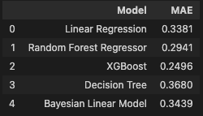
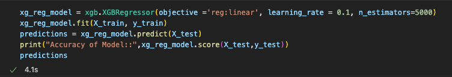

# World Happiness Analysis

## 1. Overview of World Happiness Analysis

The purpose of World Happiness Report to review the state of happiness in the world from 2015 until today and show how the new science of happiness explains personal and national variations in happiness.

##  2. DataSources

The happiness scores and rankings use data from the Gallup World Poll . The columns following the happiness score estimate the extent to which each of six factors – Log GDP per capita, Social support, Healthy life expectancy at birth, Freedom to make life choices,Generosity ,Perceptions of corruption, Positive affect, Negative affect,Confidence in national government.

* The complete dataset was sourced from [World Happiness Report](https://worldhappiness.report/ed/2022/#appendices-and-data) website
* Other additional information was found in [World Happiness Report](https://worldhappiness.report/ed/2022/#appendices-and-data) in Kaggle

### 2.1. Data Dictionary

| Variable | DataType | Description |
| -------- | -------- | ----------- |
| country_name | character | Country name |
| year | integer | Year|
| ladder_score | numeric | Life evaluation score |
| healthy_life_expectancy |	numeric | Healthy life expectancies at birth based on the data extracted from the World Health Organisation (WHO) data repository |
| social_support | numeric |Defined as having someone to count on in times of trouble (ranked from 0 to 1)
| freedom_to_make_life_choices | numeric | Defined as the national average of responses to the Gall-WorldPoll question (“Are you satisfied or dissatisfied with your freedom to choose what you do with your life?”) |
| generosity | numeric | National average of responses to the question - “Have you donated money to a charity in the past month?” |
| perception_of_corruption |numeric | National average of responses to the questions (“Is corruption widespread throughout the government or not” and “Is corruption widespread within businesses or not?” ) |

## 3. Research Questions

    1. What is the main well being factor that contributes to increase the hapiness around the world?
    2. Does a high rate of mortality is correlate with less happiness?

## 4.  Database Model

 * We are going to use PostgreSQL as our relational database management system. This is the first draft of our DB schema: 
 * 

  

## 5. Machine Learning Model
### 5.1. Independent and Dependent Variables Definition

We have defineed our dependent and independent variables and splitting them into test and train data.

  

### 5.2. Model Testing
 After analized the Datasouces we have decided to use Supervised Machine Learning model since we have labeled data. In order to find the perfect model evaluate following models: Linear Regression,Random Forest Regressor, XGBoost, Decision Tree and Bayesian Linear Model. We calculated the **Mean Absolute Error (MAE)** which refers to the magnitude of difference between the prediction of an observation and the true value of that observation.:

  

 
 We can conclude from the below table that the model with the minimun MAE is **XGBoost**, so this is the model we are going to use.
 
 

  

 
### 5.3. Applying XGBoost Model

  

  

 [Jupyter Noteboook](https://github.com/melissa95marin/Final-Project/blob/main/hapiness_models.ipynb)

## 6. Visulizations
https://public.tableau.com/app/profile/mariana.isidoro/viz/Project_16613136489750/LifeLadder?publish=yes

## 7. Communication Protocols

We agreed as a team to use Slack as our main source of communication

