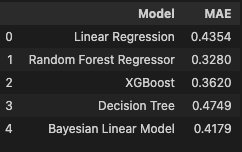
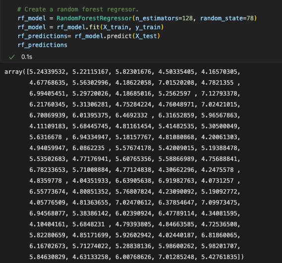

# World Happiness Analysis

## 1. Overview of World Happiness Analysis

The purpose of World Happiness Report is to review the state of happiness, the data gathered are from all over the world and are from the year 2015 to the presnent day. We will be presnting new data that incorperates the science of happiness and explain the variations that are both personal and national that play a part in todays happiness.

##  2. DataSources

The happiness scores and rankings use data from the Gallup World Poll . The columns following the happiness score estimate the extent to which each of six factors – Log GDP per capita, Social support, Healthy life expectancy at birth, Freedom to make life choices, Generosity ,Perceptions of corruption, Positive affect, Negative affect, Confidence in national government.

* The complete dataset was sourced from [World Happiness Report](https://worldhappiness.report/ed/2022/#appendices-and-data) website
* Other additional information was found in [World Happiness Report](https://worldhappiness.report/ed/2022/#appendices-and-data) in Kaggle

### 2.1. Data Dictionary

| Variable | DataType | Description |
| -------- | -------- | ----------- |
| country_name | character | Country name |
| year | integer | Year|
| ladder_score | numeric | Life evaluation score |
| healthy_life_expectancy |	numeric | Healthy life expectancies at birth based on the data extracted from the World Health Organisation (WHO) data repository |
| social_support | numeric |Defined as having someone to count on in times of trouble (ranked from 0 to 1)
| freedom_to_make_life_choices | numeric | Defined as the national average of responses to the Gall-WorldPoll question (“Are you satisfied or dissatisfied with your freedom to choose what you do with your life?”) |
| generosity | numeric | National average of responses to the question - “Have you donated money to a charity in the past month?” |
| perception_of_corruption |numeric | National average of responses to the questions (“Is corruption widespread throughout the government or not” and “Is corruption widespread within businesses or not?” ) |

## 3. Research Questions

    1. What is the main well being factor that contributes to increase the hapiness around the world?
    2. Does a high rate of mortality is correlate with less happiness?

## 4.  Database Model

 * We are going to use PostgreSQL as our relational database management system. This is the first draft of our DB schema: 
  

  

## 5. Machine Learning Model
### 5.1. Independent and Dependent Variables Definition

**Independent variables** (also referred to as Features) are the input for a process that is being analyzes. For our analysis the independent variables will be: ***Log GDP per capita, Social support, Healthy life expectancy at birth, Freedom to make life choices, Generosity , Perceptions of corruption, Positive affect, Negative affect,Confidence in national government***.

**Dependent variables** are the output of the process.The dependent value will be: ***ladder_score***.

We have defined our dependent and independent variables and splitting them into test and train data.

  

### 5.2. Model Testing
After analized the Datasouces we have decided to use Supervised Machine Learning model since we have labeled data. In order to find the perfect model we evaluate the following models: Linear Regression,Random Forest Regressor, XGBoost, Decision Tree and Bayesian Linear Model. 
We calculated the **Mean Absolute Error (MAE)** which refers to the magnitude of difference between the prediction of an observation and the true value of that observation:

  

 
We can conclude from the below table that the models with the minimum MAE are **Random Forest Regressor** and **XGBoost**.

**r2** indicates the proportion of data points which lie within the line created by the regression equation. A higher value of R2 is desirable as it indicates better results. We can import r2_score from sklearn.

In order to choose the best model, we will calculate the r2_Score value for both models.

#### 5.2.1. XGBoost Model:
We fit the test and train set into XGBoost Model:

 

  

Once we have the preditions values we proceed to calculate the r2_score:

  

#### 5.2.2.Random Forest Regressor Model
We fit the test and train set into Random Forest Regressor Model:

  

Once we have the preditions values we proceed to calculate the r2_score:

  

**Random Forest Regressor** model has a higher value of R2 than XGBoost Model, so it is the model we will use for our analysis.

### 5.3. Applying Random Forest Regressor Model

A random forest model,combines many decision trees into a forest of trees. Random forest algorithm will sample the data and build several smaller, simpler decision trees.

#### 5.3.1 Random forest algorithms benefits

* Are robust against overfitting as all of those weak learners are trained on different pieces of the data.
* Can be used to rank the importance of input variables in a natural way.
* Can handle thousands of input variables without variable deletion.
* Are robust to outliers and nonlinear data.
* Run efficiently on large datasets.

#### 5.3.2 Random forest algorithms limitations

* When using a random forest, more resources are required for computation.
* It consumes more time compared to a decision tree algorithm.

Here we can see the predicted values generated for Random Forest Regressor Model:

  

 [Jupyter Noteboook](https://github.com/melissa95marin/Final-Project/blob/main/hapiness_models.ipynb)

## 6. Visulizations

Individuals can change the year and country they want to look at according to topic. 
Story Country by Topics Interactive:https://public.tableau.com/app/profile/mariana.isidoro/viz/CountrybyTopic/CountybyTopic?publish=yes
Dashboad shows, if users wish to interact with the different visuals they can click on the story link.
Dashboard Rainbow: https://public.tableau.com/app/profile/mariana.isidoro/viz/Rainbow_16619176290710/Colors?publish=yes
Story: https://public.tableau.com/app/profile/mariana.isidoro/viz/Happiness_Rainbow/Happiness_Rainbow
## 7. Communication Protocols

We agreed as a team to use Slack as our main source of communication

## Final Presentation
https://docs.google.com/presentation/d/1lKVE8HNMGzSC6siw44W5-kzULSFGWgInrgpV2WTA1_A/edit#slide=id.p

